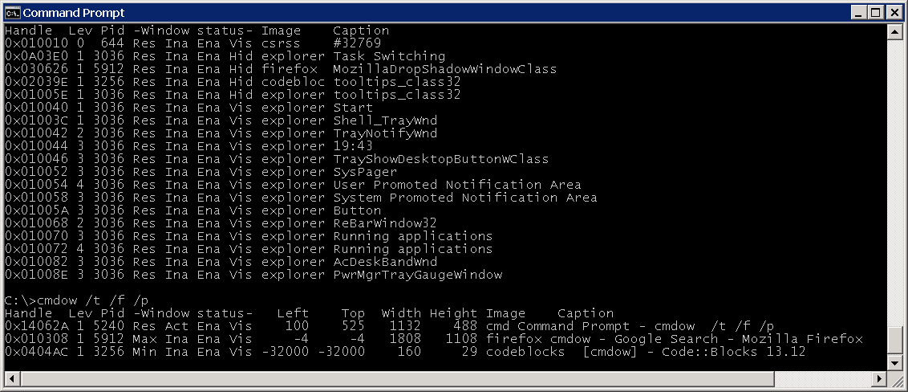
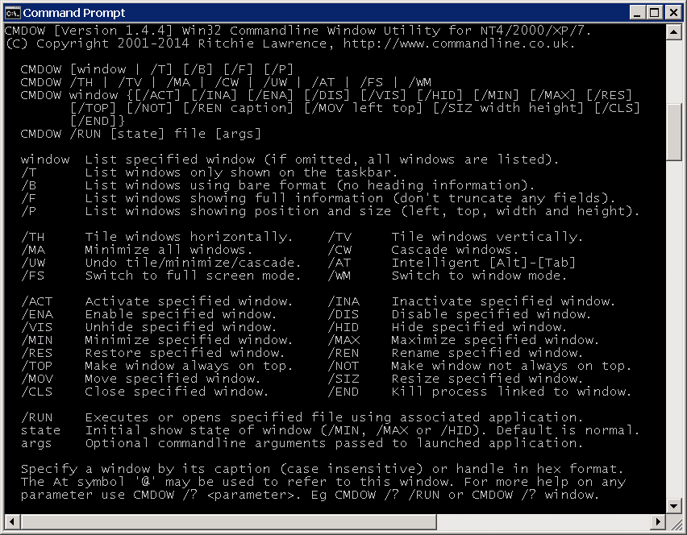
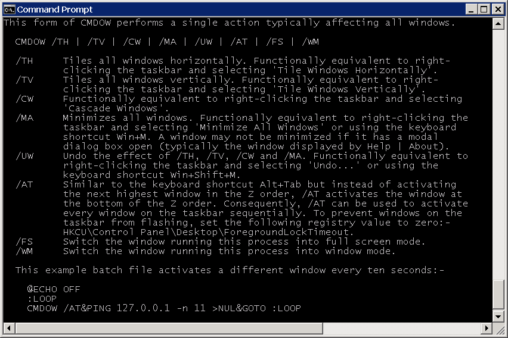
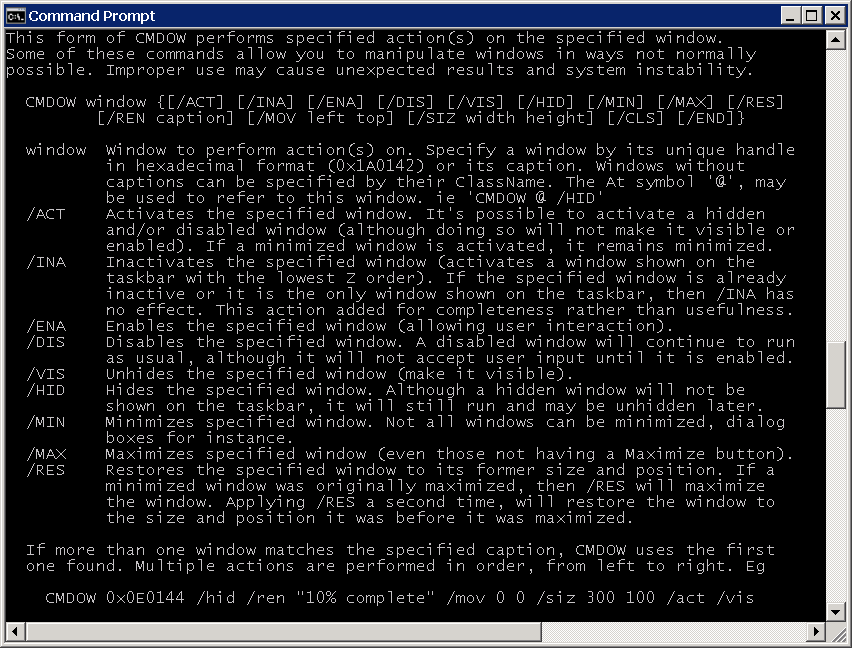
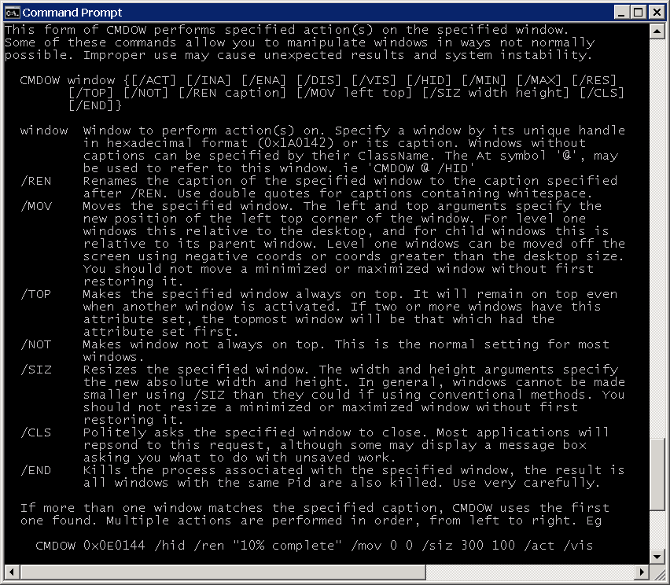
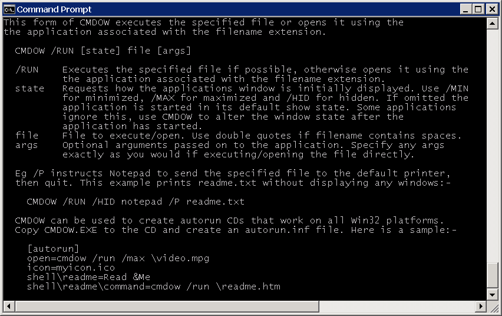

=====
Cmdow
=====

Table of Contents
-----------------

* `Is Cmdow Malware?`_
* Synopsis_
* Usage_
* Examples_
* FAQs_
* Screenshots_
* Revisions_
* `Copyright and License`_

Is Cmdow Malware?
-----------------

**Of course not!** However, one of its features allows the user to hide program windows and this has led to 40% of anti-virus vendors classifying Cmdow as anything from a hacking tool to a trojan, whilst the other 60% regard Cmdow as completely safe.

To view the anti-virus scan results yourself, download the latest version of Cmdow, extract the contents of the zip file and upload cmdow.exe to `VirusTotal`__. You'll end up at this page at a page like this: 
https://virustotal.com/en/file/767b877e735c425bf05c34683356abfde4070b092f17a4741ea5ac490611f3de/analysis/ (note, the long hexadecimal string in the URL matches the `SHA256 checksum`__ of cmdow.exe, v1.4.8 in this instance).

If you have any doubts about the safety of Cmdow, you should audit the source code and compile it yourself. This is not a difficult task as the source code is self explanatory with liberal comments and compiles without errors or warnings using the free `Code::Blocks`__ IDE. There's even a Code::Blocks project file (`cmdow.cbp`_) included in the Cmdow download.

__ https://virustotal.com/
__ https://en.wikipedia.org/wiki/Sha1sum
__ http://www.codeblocks.org/
.. _cmdow.cbp: LICENSE.txt

Synopsis
--------

Cmdow is a Win32 commandline utility for NT4/2000/XP/2003/2008/7 that allows windows to be listed, moved, resized, renamed, hidden/unhidden, disabled/enabled, minimized, maximized, restored, activated/inactivated, closed, killed and more.

It is a small standalone executable. It does not create any temporary files, nor does it write to the registry. There is no installation procedure, just run it. To completely remove all traces of it from your system, delete it.

Cmdow was written with batch file programmers in mind. Particular attention has been paid to Cmdows output making it easy to process with the 'FOR /F' command found in the Windows command processor (cmd.exe).

Cmdow is simple and intuitive to use. To list all its options, type cmdow /?. For detailed help on any option type cmdow /? <option>. Eg cmdow /? /run.

Usage
-----

This form of CMDOW lists window details.

::

  CMDOW [window | /T] [/B] [/F] [/P]

  window  Window to list. Specify a window by its handle (in hex format, eg
          0x1A0142) or caption (window title). Caption is case insensitive.
          Use asterisk before/after caption to match zero or more characters.
          Windows without captions are matched by their ClassName. Use double
          quotes for captions containing whitespace or control characters. The
          At symbol '@' may be used to refer to this window. eg 'CMDOW @ /HID'.
  /T      List only the windows shown on the taskbar (these are typically
          visible level 1 windows that do not have an owner).
  /B      Bare format. Does not print the field names when listing windows.
  /F      Full format. By default CMDOW truncates Image names to eight
          characters and Captions/ClassNames to fit under 80 characters.
          Use this option to disable this feature.
  /P      Shows window position, coords of top left corner of the window and
          its absolute width and height in pixels.

Here is a description of the output fields:-

::

  Handle         Handle of the window, in hexadecimal format (0x000123AB).
  Lev            Level of the window. The desktop window at level 0 is the area
                 on which all other windows are painted. Top level windows are
                 level 1 (and may be shown on the taskbar), all windows of
                 level 2+ are child windows.
  Pid            Process Id of the window (Task Manager also shows Pids).
  Window status  How the window is displayed (Minimized, Maximized, Restored,
                 Active, Inactive, Enabled, Disabled, Visible or Hidden).
  Left, Top      Coords of left top corner of the window relative to the
                 parent window. For top level windows this is the desktop, and
                 for child windows it is their top level window.
  Width, Height  Absolute width and height of the window in pixels.
  Image          Executable that created the window (Task Manager also shows
                 Image Names on its Process tab).
  Caption        Window title. If a window has no caption, its ClassName is
                 listed instead.

This form of CMDOW performs a single action typically affecting all windows.

::

  CMDOW /TH | /TV | /CW | /MA | /UW | /AT | /FS | /WM

  /TH     Tiles all windows horizontally. Functionally equivalent to right-
          clicking the taskbar and selecting 'Tile Windows Horizontally'.
  /TV     Tiles all windows vertically. Functionally equivalent to right-
          clicking the taskbar and selecting 'Tile Windows Vertically'.
  /CW     Functionally equivalent to right-clicking the taskbar and selecting
          'Cascade Windows'.
  /MA     Minimizes all windows. Functionally equivalent to right-clicking the
          taskbar and selecting 'Minimize All Windows' or using the keyboard
          shortcut Win+M. A window may not be minimized if it has a modal
          dialog box open (typically the window displayed by Help | About).
  /UW     Undo the effect of /TH, /TV, /CW and /MA. Functionally equivalent to
          right-clicking the taskbar and selecting 'Undo...' or using the
          keyboard shortcut Win+Shift+M.
  /AT     Similar to the keyboard shortcut Alt+Tab but instead of activating
          the next highest window in the Z order, /AT activates the window at
          the bottom of the Z order. Consequently, /AT can be used to activate
          every window on the taskbar sequentially. To prevent windows on the 
          taskbar from flashing, set the following registry value to zero:-
          HKCU\Control Panel\Desktop\ForegroundLockTimeout.
  /FS     Switch the window running this process into full screen mode.
  /WM     Switch the window running this process into window mode.

  This example batch file activates a different window every ten seconds:-

    @ECHO OFF
    :LOOP
    CMDOW /AT&PING 127.0.0.1 -n 11 >NUL&GOTO :LOOP

This form of CMDOW performs specified action(s) on the specified window(s).
Some of these commands allow you to manipulate windows in ways not normally
possible. Improper use may cause unexpected results and system instability.

:: 

  CMDOW window {[/ACT] [/INA] [/ENA] [/DIS] [/VIS] [/HID] [/MIN] [/MAX] [/RES]}

  window  Window to act on. Specify a window by its handle (in hex format, eg
          0x1A0142) or caption (window title). Caption is case insensitive.
          Use asterisk before/after caption to match zero or more characters.
          Windows without captions are matched by their ClassName. Use double
          quotes for captions containing whitespace or control characters. The
          At symbol '@' may be used to refer to this window. eg 'CMDOW @ /HID'.
  /ACT    Activates the specified window. It's possible to activate a hidden
          and/or disabled window (although doing so will not make it visible or
          enabled). If a minimized window is activated, it remains minimized.
  /INA    Inactivates the specified window (activates a window shown on the
          taskbar with the lowest Z order). If the specified window is already
          inactive or it is the only window shown on the taskbar, then /INA has
          no effect. This action added for completeness rather than usefulness.
  /ENA    Enables the specified window (allowing user interaction).
  /DIS    Disables the specified window. A disabled window will continue to run
          as usual, although it will not accept user input until it is enabled.
  /VIS    Unhides the specified window (make it visible).
  /HID    Hides the specified window. Although a hidden window will not be
          shown on the taskbar, it will still run and may be unhidden later.
  /MIN    Minimizes specified window. Not all windows can be minimized, dialog
          boxes for instance.
  /MAX    Maximizes specified window (even those not having a Maximize button).
  /RES    Restores the specified window to its former size and position. If a
          minimized window was originally maximized, then /RES will maximize
          the window. Applying /RES a second time, will restore the window to
          the size and position it was before it was maximized.

  If more than one window matches the specified caption, CMDOW only acts on the
  first one. To override this add the /DBM (Don't Blame Me) switch - DANGEROUS.
  Multiple actions are performed in order, from left to right. Eg:-

    CMDOW 0x0E0144 /hid /ren "10% complete" /mov 0 0 /siz 300 100 /act /vis

This form of CMDOW executes the specified file or opens it using the
application associated with the filename extension.

::

  CMDOW /RUN [state] file [args]

  /RUN    Executes the specified file if possible, otherwise opens it using the
          application associated with the filename extension.
  state   Requests how the application's window is initially displayed. Use
          /MIN for minimized, /MAX for maximized and /HID for hidden. If
          omitted the application is started in its default show state. Some
          applications ignore this, use CMDOW to alter the window state after
          the application has started.
  file    File to execute/open. Use double quotes if filename contains spaces.
  args    Optional arguments passed on to the application. Specify any args
          exactly as you would if executing/opening the file directly.

  Eg /P instructs Notepad to send the specified file to the default printer,
  then quit. This example prints readme.txt without displaying any windows:-

    CMDOW /RUN /HID notepad /P readme.txt

  CMDOW can be used to create autorun CDs that work on all Win32 platforms.
  Copy CMDOW.EXE to the CD and create an autorun.inf file. Here is a sample:-

    [autorun]
    open=cmdow /run /max \video.mpg
    icon=myicon.ico
    shell\readme=Read &Me
    shell\readme\command=cmdow /run \readme.htm

Examples
--------

View the Cmdow main help screen:-

::

    cmdow /?

View help about the /MOV (move a window) option:-

::

    cmdow /? /mov

To list details of all windows:-

::

    cmdow

To list details of only the windows listed on the taskbar:-

::

    cmdow /t

To list details and positions of only the windows listed on the taskbar:-

::

    cmdow /t /p

To list details of a particular window:-

::

    cmdow "untitled - notepad" or Cmdow 0x010052

where 0x010052 is the window handle of the window titled "untitled - notepad".

Tile all windows vertically:-

::

    cmdow /tv

Bearing in mind that the Cmdow actions are carried out in the order in which they are specified (that is, from left to right), this example restores, moves, renames and finally activates Calc.exe:-

::

    cmdow Calculator /res /mov 100 200 /ren "New Caption" /act

Batch file to activate a different window every 10 seconds:-

::

    @echo off
    :loop
    cmdow /AT
    ping 127.0.0.1 -n 11 >nul
    goto :loop

Batch file to close all windows listed on the taskbar:-

::

    @echo off
    :: Hide this console window so its not shown on taskbar
    cmdow @ /hid
    for /f %%a in ('cmdow /t') do cmdow %%a /cls
    :: Now close this console window
    cmdow @ /cls

Stupid batch file to remove all the buttons from Calculator:-

::

    @echo off
    :: run calc and give it time to fully load
    start calc & ping 127.0.0.1 -n 2 >nul
    :: hide windows at level 2 and whose image is calc
    for /f "tokens=1-2,8" %%a in ('cmdow') do (
      if /i "%%c"=="calc" if "%%b"=="2" cmdow %%a /hid
    )

Batch file to retrieve display resolution. The co-ords of the first window listed by Cmdow is the screen resolution (this window also has a level of zero which can be identifed using FOR /F):-

::

    @echo off
    for /f "tokens=2,10-11" %%a in ('cmdow /p') do (
      if "%%a"=="0" set "WIDTH=%%b" & set "HEIGHT=%%c"
    )
    echo Resolution is %WIDTH%x%HEIGHT%

Run a program hidden:-

::

    cmdow /run /hid myprog.exe

Run a batch file hidden passing it parameters:-

::

    cmdow /run /hid mybat arg1 "arg 2"

Batch file to alert Administrator if the number of windows shown on the taskbar changes (as might be the case when an application or the operating system generates an error message, or may be backup software is prompting for a tape etc). Loops every 60 seconds until number of windows changes.

::

    @echo off&setlocal&set LAST=
    cmdow @ /hid
    :loop
    ping 127.0.0.1 -n 61 >nul & set "THIS=0"
    for /f %%a in ('cmdow /t /b') do set /a THIS+=1
    if not defined LAST set "LAST=%THIS%"
    if %THIS% NEQ %LAST% (goto:alert) else (set LAST=%THIS%)
    goto:loop
    :alert
    net send administrator Change in windows on taskbar.
    cmdow @ /vis

Creating an Autorun CD. Copy your autorun.inf file and cmdow.exe to the root of the CD. Here is a sample autorun.inf. It also shows how add a context menu for the CD. This could be used to install software required by your CD or to view a readme file etc:-

::

    [autorun]
    open=cmdow /run /max \video.mpg
    icon=myicon.ico
    shell\readme=Read &Me
    shell\readme\command=cmdow /run \readme.htm
    shell\install\=&Install Realplayer
    shell\install\command=rp8-complete2-u1-setup.exe

Here is another use suggested by a Cmdow user:-

Cmdow can be used to save the window status and restore it, after the execution of a program. For example, if you are displaying information in a maximised Command Prompt window and then need to call a program (NOTEPAD, perhaps), which gives a second window, the current Command Prompt window is minimised to the taskbar. You would normally need to click on it to restore the original window and give it the focus. You can use CMDOW to save the status of the window, and cause it to be restored automatically in a maximised form, using the following:

::

    :: save the current window status
    for /f "tokens=4" %%a in ('cmdow @ /b') do set wstate=%%a
    :: call NOTEPAD to display this BATch file (or anything else!)
    call notepad "%~f0"
    :: (it is assumed that the user now closes the NOTEPAD window)
    :: if the window status was maximised previously, return it to that state
    if "%wstate%"=="Max" cmdow @ /max
    echo Here we are again, back in our maximised window!

FAQs
----

> How can I disable or hide the desktop?

>> Running Cmdow without any options lists all windows. The window at the top of the list is the desktop window only as far Windows is concerned (and has a level of 0). However, the window that you and I know as the desktop is found at the end of the list. It will typically be the last window listed with a level of 1 (and by default its caption is "Program Manager").
So running Cmdow "Program Manager" /hid will hide the deskop. If you have another window titled "Program Manager", then you'll need to use an alternative method. See the example scripts.

----

> On a W2K machine running a number of applications that monitor our servers and networks, I have a batch file that runs Cmdow /AT every 20 seconds. Sometimes Cmdow fails to activate an application window, instead the taskbar flashes blue.

>> This is a new 'feature' of W2K. Its known as Foreground Lock Timeout, and basically prevents another application setting the foreground window. You can safely disable this feature using TweakUI or by setting the value of this registry key to zero:-

HKEY_CURRENT_USER\\Control Panel\\Desktop\\ForegroundLockTimeout

----

> When I use Cmdow at a command prompt or in a batch file and try to change the console title. Why does the title revert back when Cmdow finishes or when the batch file ends?

>> This has been fixed in version 1.4.1.

----

> How can I undo the effects of tiling, cascading or minimizing all windows?

>> In version 1.4.2 the /UM switch has been superseded by /UW. This new switch will undo the effect of tiling/cascading and minimizing all windows. To maintain compatability with existing scripts, the /UM switch can still be used even though it's no longer documented on Cmdow's helpscreen. /UM now has exactly the same effect as /UW.

Screenshots
-----------

Revisions
.........

+--------+----------+---------------------------------------------------------------------------------+
|Revision|Date      |Changes                                                                          |
+========+==========+=================================================================================+
|1.0     |2001-12-20|Cmdow created.                                                                   |
+--------+----------+---------------------------------------------------------------------------------+
|1.1     |2002-02-25|Added /RUN command.                                                              |
+--------+----------+---------------------------------------------------------------------------------+
|1.2     |2002-10-29|Fixed issue caused when conole windows have no title. Enhance /AT feature to     |
|        |          |restore an activated window if it was minimized.                                 |
+--------+----------+---------------------------------------------------------------------------------+
|1.3     |2002-11-20|Added /FS and /WM options to allow switching between full screen mode and window |
|        |          |mode.                                                                            |
+--------+----------+---------------------------------------------------------------------------------+
|1.4     |2002-11-07|Added /TOP and /NOT options to allow the setting/clearing of windows 'always on  |
|        |          |top'. Fixed argument parsing bug for /MOV and /REN options.                      |
+--------+----------+---------------------------------------------------------------------------------+
|1.4.1   |2003-05-14|Cmdow can now rename the console window that launched it. Previously the title   |
|        |          |would revert when Cmdow exited.                                                  |
+--------+----------+---------------------------------------------------------------------------------+
|1.4.2   |2003-08-18|/UM seperseded by /UW switch. See FAQ's for details.                             |
+--------+----------+---------------------------------------------------------------------------------+
|1.4.3   |2004-12-19|Fixed bug where renaming the current console window would fail if the new caption|
|        |          |title contained whitespace.                                                      |
+--------+----------+---------------------------------------------------------------------------------+
|1.4.4   |2014-11-08|Cmdow is now open source software released under the MIT license.                |
+--------+----------+---------------------------------------------------------------------------------+
|1.4.7   |2014-12-29|Wildcards can now be used to filter window captions. Also now possible to perform|
|        |          |actions on multiple windows. Handle display is extended to eight digits. Level is|
|        |          |dynamically sized. Class name is dynamically sized. Newlines in the caption are  |
|        |          |converted to underscore. Sizes are based on the entire window list, not just what|
|        |          |is displayed. Help pages updated. Internally: Remove process name length test, as|
|        |          |WideCharToMultiByte already restricts it. Combined multiple printfs. Substituted |
|        |          |some if/else assignments for ternary operator.                                   |
+--------+----------+---------------------------------------------------------------------------------+
|1.4.8   |2014-12-30|Help page typos corrected. Output can handle 5-digit PIDs.                       |
+--------+----------+---------------------------------------------------------------------------------+

Copyright and License
.....................

Code and documentation copyright 2001-2014 Ritchie Lawrence. Code released under `MIT License`_.

.. _MIT License: LICENSE.txt
